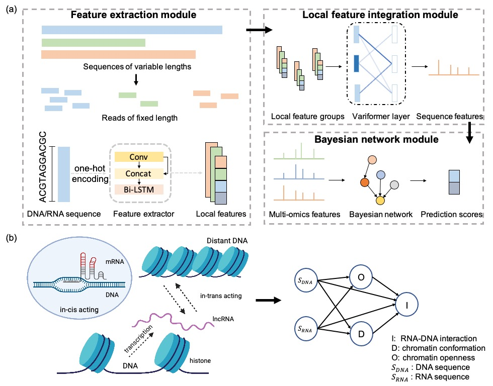

# DeepRCI: Predicting RNA-chromatin interactions via deep learning with multi-omics data

DeepRCI is a deep learning framework for RNA-Chromatin Interactions through integrating Multi-Genomics Data. This is an instruction of predicting RNA-Chromatin Interactions using DeepRCI.
# Overview of DeepRCI

* The illustration of the underlying biological mechanism is created with [Biorender](https://www.biorender.com)
# Dependencies
This repository has been tested on Ubuntu 16.04. We strongly recommend you to have [Anaconda3](https://www.anaconda.com/distribution/) installed, which contains most of the required packages for running this model.

### Must installed packages or softwares

- pytorch  2.4.1

- tensorflow-gpu 1.9

- seaborn 0.11.2

- numpy 1.19.5

- sklearn 1.0.1

- biopython [optional, for data generation]

- cd-hit 4.8.1 [optional, for data generation]

# Usage

## main argument
- --experiment: name for each experiment
- --mode: train or test the model
- --model: select models you want, including bayesian and simple
- --seed: experiment seed for reproducibility
- --kernel_size: convolutional kernel size
- --dataset: directory to your dataset
- --hidden_dim: dimension for hidden units

## Test with pre-trained model

```bash
cd src
python DeepCRI.py --experiment bayesian  --model bayesian --mode test
```
## Train with your own data

```bash
cd src
python DeepCRI.py --experiment bayesian --model bayesian --mode train --dataset YOUR_DATA_DIRECTORY
```

# Data Preparation

- Download RNA-chromatin interaction pairs from GEO database with accession number [GSM4006840](https://www.ncbi.nlm.nih.gov/geo/query/acc.cgi?acc=GSM4006840), and move it to `iMARGI/data/`
- Download reference genome from [ENCODE](https://www.encodeproject.org/files/GRCh38_no_alt_analysis_set_GCA_000001405.15/@@download/GRCh38_no_alt_analysis_set_GCA_000001405.15.fasta.gz), and move it to `ref/`
- Download HiC data and ATAC-seq data from GEO database with accession numbers [GSM4006837](https://www.ncbi.nlm.nih.gov/geo/query/acc.cgi?acc=GSM4006837) and [GSM4006837](https://www.ncbi.nlm.nih.gov/geo/query/acc.cgi?acc=GSM4006837), and move it to `tutorial/figure/data`

- Optional [for tutorial figure]

    - Download gene annotation data from [Gencode](http://ftp.ebi.ac.uk/pub/databases/gencode/Gencode_human/release_38/gencode.v38.chr_patch_hapl_scaff.annotation.gff3.gz), and unzip it to  `tutorial/figure`.
    - Download RNA seq data from GEO database with accession number [GSM4006843](https://www.ncbi.nlm.nih.gov/geo/query/acc.cgi?acc=GSM4006843)

## Reproduce figures in the paper

```bash
cd tutorial/figure/data
unzip /samples.zip
cd ../

# for figure2-3
ipython
%run plot_figure.ipynb
# for figure 4a
python plot_figure4_a.py
# for figure 4b
python plot_figure4_b.py
# for figure 4c
python plot_figure4_c.py
```
### Motif results
The motif results were generated by [TOMTOM (version 5.0.5)](https://meme-suite.org/meme/tools/tomtom). Details for the files are listed in the table below.
| File name | Description |
| :-------: | :--------: |
| tutorial/motifs/dna_motifs.csv | DNA motifs mapped to CIS-BP database |
| tutorial/motifs/rna_motifs.csv | RNA motifs mapped to CISBP-RNA database |

The column names of these tables are described at http://meme-suite.org/doc/tomtom-output-format.html.

## Utility files

| File name | Description |
| :-------: | :--------: |
| layer.py | Neural network definition of different model |
| utils.py | Utility functions |
| const.py | Constants used in our model |
| layers.py | neural network definition of different model |
| dataset.py | dataset definition in Pytorch |
